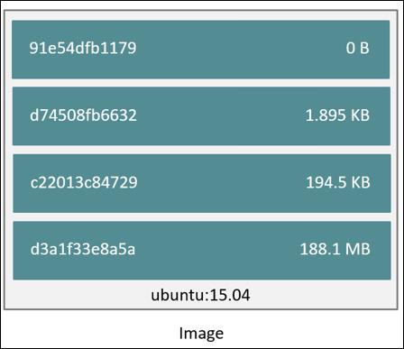
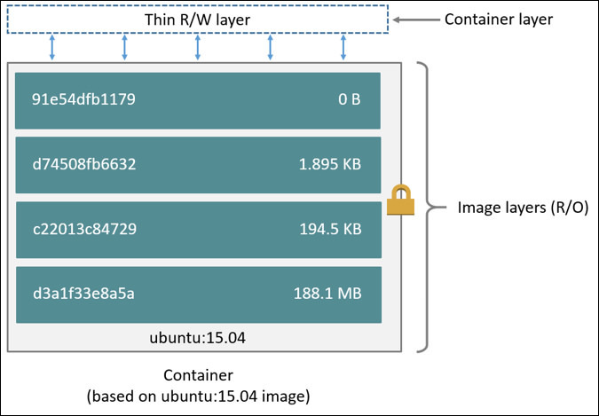

# Lab 02 : Introduction to Docker

> **Difficulty**: Easy

> **Time**: 15 minutes

> **Tasks**:
>- [Prerequisites](#prerequisites)
- [Task 1: Running your first container](#task-1-running-your-first-container)
- [Task 2: Distinguishing images and containers](#task-2-distinguishing-images-and-containers)
- [Task 3: Run an existing container](#task-3-run-an-existing-container)
- [Task 4: Enter the container](#task-4-enter-the-container)

> **Credits**: This lab is a modified version of [https://github.com/docker/dceu_tutorials](https://github.com/docker/dceu_tutorials)


### What is Docker?

Docker is an open platform for building, shipping and running distributed
applications. It gives programmers, development teams and operations engineers
the common toolbox they need to take advantage of the distributed and networked
nature of modern applications. This tutorial uses some simple tasks to
introduce you to Docker concepts and operations.

The Docker platform is composed of several products. To use Docker to build
images and share them with others, at minimum, you need Docker Engine and Docker
Hub.

### Docker Engine

Docker Engine is responsible for building images and running containers. The
Engine consists of a command-line (CLI) client and a server (daemon) process.
When you install Docker Engine on your machine, both the server and the
command-line client are installed.

The server runs as a daemon process on your machine. It manages images and
containers on your system. The command-line client is used to instruct the
daemon in this management.

Docker is built using a client-server architecture. Behind the scenes, the CLI
wraps a well-defined remote API. Any commands executed by the client get translated
to API calls that are made to the daemon. You can use this same API to communicate
with the daemon using standard API calls over HTTP/HTTPS.

### Docker Hub

Docker Hub is a cloud-based registry service for building, storing, and shipping application or service images.
It provides a graphical user interface and allows you to store your images
privately or make them publicly available to other Docker users. Underlying the
Docker Hub is Docker's Registry technology. This registry is an image repository
available to the public.

To use Docker Hub, you simply create an account. Once you have an account, you
can use the Engine CLI client to log into and push your images to the Hub.

## Prerequisites

Make sure you have already [created a Docker Hub account](00-prerequisites.md) before beginning this lab.


## Task 1: Running your first container

To run your first Docker container, simply run the command below:

```
docker run hello-world
```

When succesful you will be prompted with the following output:

```
Unable to find image 'hello-world:latest' locally
Trying to pull repository docker.io/library/hello-world ... 
latest: Pulling from docker.io/library/hello-world

ca4f61b1923c: Pull complete 
Digest: sha256:66ef312bbac49c39a89aa9bcc3cb4f3c9e7de3788c944158df3ee0176d32b751

Hello from Docker!
This message shows that your installation appears to be working correctly.

To generate this message, Docker took the following steps:
 1. The Docker client contacted the Docker daemon.
 2. The Docker daemon pulled the "hello-world" image from the Docker Hub.
 3. The Docker daemon created a new container from that image which runs the
    executable that produces the output you are currently reading.
 4. The Docker daemon streamed that output to the Docker client, which sent it
    to your terminal.

To try something more ambitious, you can run an Ubuntu container with:
 $ docker run -it ubuntu bash

Share images, automate workflows, and more with a free Docker Hub account:
 https://hub.docker.com

For more examples and ideas, visit:
 https://docs.docker.com/engine/userguide/
```

Next, try to issue the following commands and observe the output:

 - `docker info` Provides information on Docker Engine settings. This includes information such as:
    * number of running containers
    * number of cached images
    * storage backend
    * operating system
    * root directory
 - `docker ps` Lists currently running containers. None are visible since our first container stopped immediately after printing some text.
 - `docker ps -a` Lists all running or stopped containers.
 - `docker images` Lists all available images. You should see at least one, the `hello-world` image, which was pulled and used to create our first container.


## Task 2: Distinguishing images and containers

Docker images are a series of read-only layers that are stacked on top of each
other to form a single unified view. The first image in the stack is called a
*base image* and all the other layers are stacked on top of this layer. The
diagram below shows the Ubuntu 15:04 image comprising 4 stacked image layers.



When you make a change inside a container by, for example, adding a new file to
the Ubuntu 15.04 image, you add a new layer on top of the underlying image
stack. This change creates a new image layer containing the newly added file.
Each image layer has its own universal unique identifier (UUID) and each
successive image layer builds on top of the image layer below it.

Containers (in the storage context) are a combination of a Docker image with a
thin writable layer added to the top known as the *container layer*.  The
diagram below shows a container running the Ubuntu 15.04 image.



The major difference between a container and an image is this writable layer.
All writes to the container that add new or modifying existing data are stored
in this writable layer. When the container is deleted the writable layer is
also deleted. The image remains unchanged.

You can run containers from images that you built or that you pulled from the
Docker Hub. Docker Hub has millions of images that are created and shared by
regular users. Additionally, Docker Hub hosts official images ( e.g
Ubuntu, Redis, and Mongo) that are created and maintained by their respective
companies.

Issue the following commands and observe the output:

1. Search Docker Hub for all images that include the word "ubuntu" in them.

  ```
  docker search ubuntu
  ```

  When you execute this command you search Docker Hub for all images that contain the word 'ubuntu' in them. You can search Docker Hub from the web if you go to [www.hub.docker.com](https://hub.docker.com/explore/).

  You'll notice that the search results include an `OFFICIAL` column. Official images are certified by Docker to indicate that they are built using certain standards. You'll find a list of official images here : https://github.com/docker-library/official-images/tree/master/library.

2. Pull the `ubuntu` image.

  ```
  docker pull ubuntu:latest
  ```

  The output should be something like:
  
  ```
  latest: Pulling from library/ubuntu
  
  c63fb41c2213: Pull complete
  99fcaefe76ef: Pull complete
  5a4526e952f0: Pull complete
  1d073211c498: Pull complete
  Digest: sha256:8b1bffa54d8a58395bae61ec32f1a70fc82a939e4a7179e6227eb79e4c3c56f6
  Status: Downloaded newer image for ubuntu:latest
  ```

  You requested to pull the official ubuntu image. The word 'latest' is a tag used to identify the specific version of the image to pull. If the image name and tag are found in Hub, each layer of the image is downloaded and cached locally.

3. Verify which images you have downloaded

  ```
  docker images
  ```
  
  The output should be something like:
  
  ```
  REPOSITORY          TAG                 IMAGE ID            CREATED              VIRTUAL SIZE
  ubuntu              latest              1d073211c498        10 days ago          187.9 MB
  hello-world         latest              0a6ba66e537a        2 weeks ago          960 B
  ```


## Task 3: Run an existing container

Let's run a container that's actually of any use. An apache webserver is used to show webpages.

1. Search for `Apache` in the Docker Hub.

  ```
  docker search httpd
  ```
  
2. We'll take httpd, which is the Red Hat distribution equivalent of the Ubuntu apache2 package. It's also an official image. It's optional to pull the image.

  ```
  docker pull httpd:latest
  ```
 
3. Then run the container on ports 80 in detached mode.
 
  ```
  docker run -dp 80:80 httpd:latest
  ```
 
4. Observe the container's output on port 80.
 
  ```
  curl localhost:80
  ```
 
 Or go to your browser, and type `instanceteam<YOUR_ID>.workshop.gluo.cloud:80`.
 
 It should display `<html><body><h1>It works!</h1></body></html>`.
 
5. It didn't quit like our hello-world container, it's still running.

  ```
  docker ps
  ```
 
 
## Task 4: Enter the container

The `docker exec` command is used to execute commands in the container as long as it's running. 

1. First fetch the container's ID. 

  ```
  docker ps
  ```
  
2. Copy the `CONTAINER ID` field of the container to your clipboard.

3. Let's find all files named "index.html" in the container.

  ```
  docker exec <CONTAINER_ID> find / -name index.html
  ```
  
  ``` 
  /usr/local/apache2/htdocs/index.html
  /usr/share/doc/adduser/examples/adduser.local.conf.examples/skel.other/index.html
  /usr/share/doc/libapr1-dev/html/index.html
  /usr/share/doc/libaprutil1-dev/html/index.html
  /usr/share/doc/libexpat1-dev/expat.html/index.html
  ```

4. Using the CLI we can enter the container and execute a limited set of commands. Limited since the container isn't a full OS and parts deemed unnecessary were trimmed from it to make it as lightweight as possible. The "-ti" flags in the following command are used to link the container's CLI to our current terminal window and make it interactive.

  ```
  docker exec -ti <CONTAINER_ID> /bin/bash
  ```
  
5. Change the "index.html" file to your liking, but please keep it decent :).

  ```
  echo '<html><body></body></html>' > /usr/local/apache2/htdocs/index.html
  ```
  
6. Exit the container.

  ```
  exit
  ```


## Update scoring
Run `checkscore` once your reach this task to update your scoring for this lab!  


## Conclusion

Congratulations, You have successfully completed this lab! You learned how to search and run an existing images as containers from the hub, execute commands on them, enter containers from the CLI and stop and remove containers and images.

Continue to the next lab. ([Next lab](../Lab%203%20-%20Creating%20your%20own%20containers))
