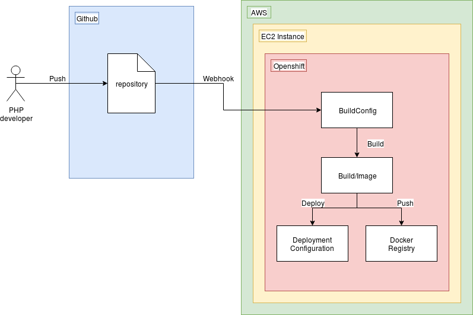
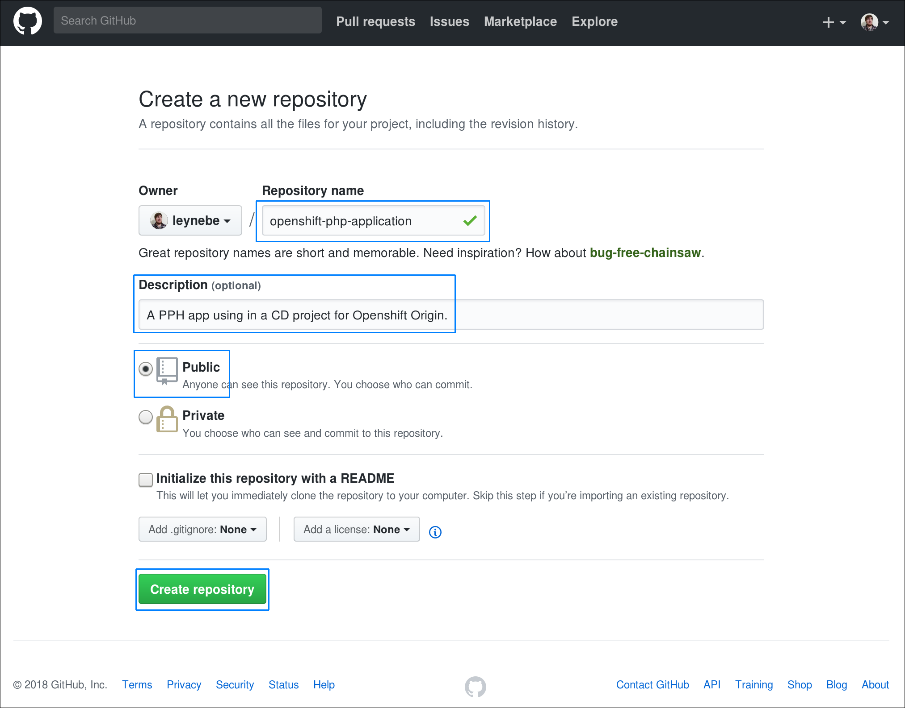
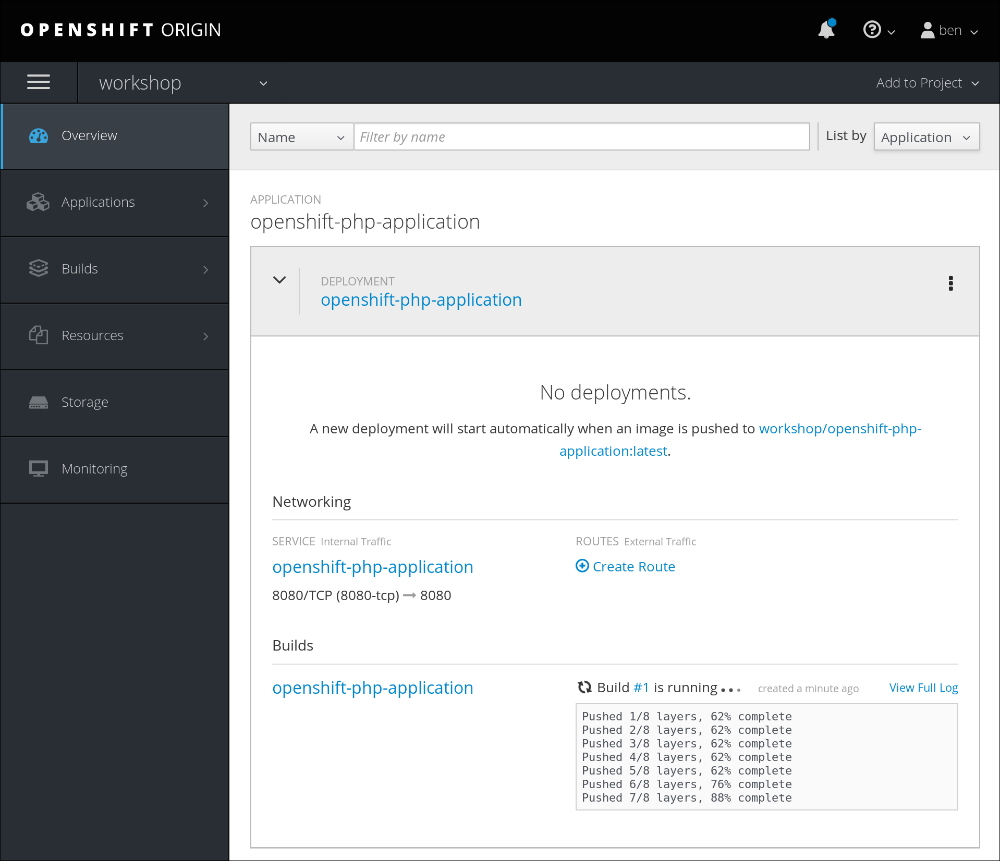
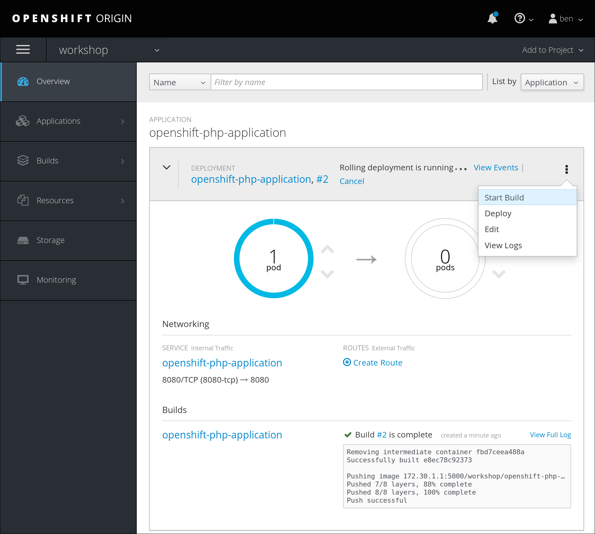
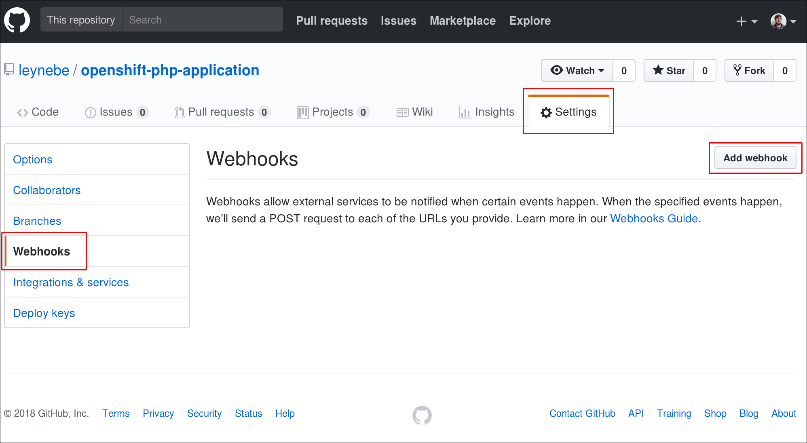
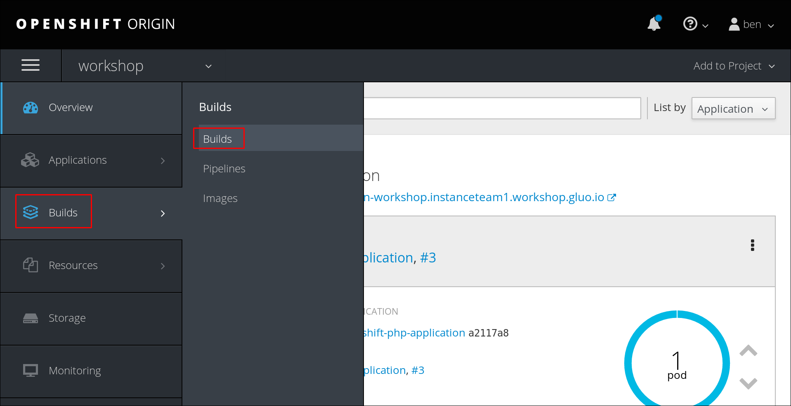
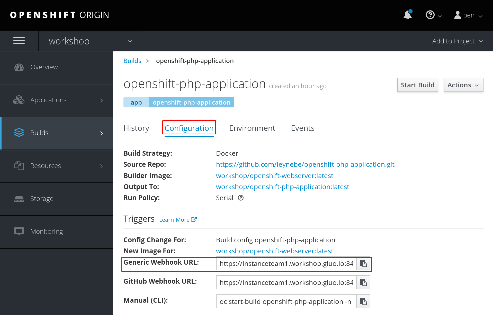
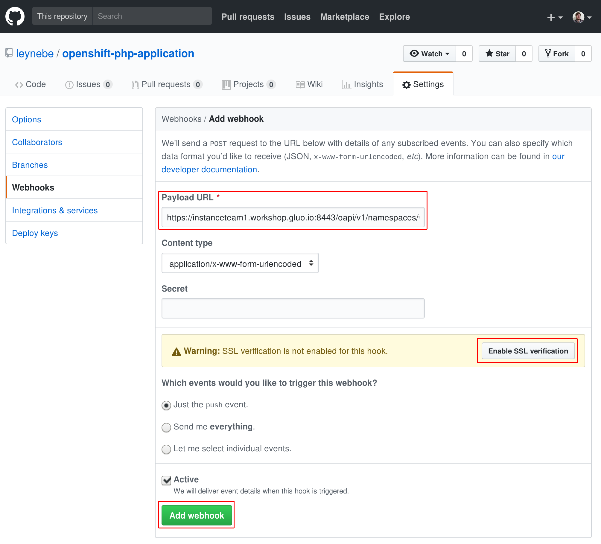
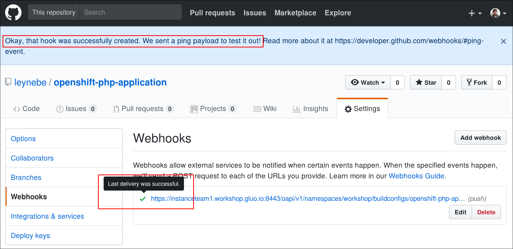

# Lab 06 : Create an Openshift application

> **Difficulty**: Medium

> **Time**: 30-40 minutes

> **Tasks**:
> - [Task 1: Create a project](#task-1-create-a-project)
> - [Task 2: Create and push a base image](#task-2-create-and-push-a-base-image)
> - [Task 3: Create your own Github repository](#task-3-create-your-own-github-repository)
> - [Task 4: Fill the application repository](#task-4-fill-the-application-repository)
> - [Task 5: Create an Openshift application](#task-5-create-an-openshift-application)
> - [Task 6: Expose the application](#task-6-expose-the-application)
> - [Task 7: Make a repository change and do a rebuild](#task-7-make-a-repository-change-and-do-a-rebuild)
> - [Task 8: Enable the Github Webhook](#task-8-enable-the-github-webgook)
> - [Task 9: Test the webhook](#task-9-test-the-webhook)


## Project



Let's create a Continuous Deployment setup!
Our application is going to be a PHP website hosted by an Apache webserver on a container.
The application's data is going to be stored in a Github repository.
Whenever we push changes to the repo a Github webhook will alert the Openshift project and it will build and run a docker image containing our latest push.
Openshift will then automagically realize a newer image is available and spin up newer containers and spin down older ones.


## More info

Openshift has many new definitions / words. If during this tutorial you're lost, look at the `INFO.md` file in this repository's folder for handy commands and explanations or go to the [Openshift Origin website](https://docs.openshift.org/latest/welcome/index.html) for the official documentation.


## Task 1: Create a project

Being logged in to the Openshift master instance allows us to log in as the system administrator. Let's log in and create a new project.

1. Log in as the system administrator.

  ```
  oc login -u system:admin
  ```

  ```
  oc whoami
  ```

2. Create a new project called `workshop`. You'll automatically switch to that new project.

  ```
  oc new-project workshop
  ```

3. List all projects and view a project's status

  ```
  oc projects
  ```
  
  ```
  oc get project
  ```


## Task 2: Create and push a base image

It's best to start from a base image when creating your own application, this way you don't have to build the entire container over and over again and it gives you a nice separation between the application logic and underlying base image or "operating system" logic.

We're also doing this because Openshift enforces some strict container runtime user permissions (with no root execution) and building your own base image would cost too much time.

The image we're about to build and push to our own Hub is an Openshift compatible PHP and Apache server, which gets its web files from its /app/ directory ([Github Project](https://github.com/weepee-org/openshift-apache-php7)). I forked the project and made some very small changes so the master branch actually builds and doesn't fail.

1. Git clone the base image repository to the instance.

  ```
  git clone https://github.com/leynebe/openshift-apache-php7 ~/openshift-apache-php7
  ```
  
2. Enter the repository directory.

  ```
  cd ~/openshift-apache-php7
  ``` 
  
3. Build the image

  ```
  docker build -t <YOUR_DOCKER_HUB_USERNAME>/openshift-webserver:latest .
  ```
  
4. Push the image to your Docker Hub.

  ```
  docker push <YOUR_DOCKER_HUB_USERNAME>/openshift-webserver:latest
  ```

  
## Task 3: Create your own Github repository

In lab0 you should have created your own Github account. Let's create a repository to house our PHP application.

1. Click the following link.

  ```
  https://github.com/new
  ```

2. Create a repository named `openshift-php-application`.

  

3. Copy the link.

  

4. Clone the repository on the instance, provide your Github credentials if asked.

  ```
  git clone https://github.com/<your_github_username>/openshift-php-application.git ~/openshift-php-application
  ```


## Task 4: Fill the application repository

The repository is empty. Let's fill it up with our application.

1. Enter the repository folder on the instance.

  ```
  cd ~/openshift-php-application
  ```

2. Create a Dockerfile named `Dockerfile` and a PHP page named `index.php`.

  ```
  touch Dockerfile index.php
  ```
  
3. Fill the `Dockerfile` with the following contents **and change the FROM command to your own Docker Hub username**.

  ```
  FROM <YOUR_DOCKER_HUB_USERNAME>/openshift-webserver:latest
  COPY . /app/
  ```

3. Fill the `index.php` page with the following contents **or make something yourself!**.

  ```
  <!DOCTYPE html>
  <html lang="en">
  <head>
    <meta charset="utf-8">
    <title>PHP APP (<?php echo gethostname();?>)</title>
    <meta name="viewport" content="width=device-width, initial-scale=1.0">
    <style>
        html{	height:100%;}
        body{	font-family:Helvetica,Arial;	display:flex;	display:-webkit-flex;	align-items:center;	justify-content:center;	-webkit-align-items:center;	-webkit-box-align:center;	-webkit-justify-content:center;	height:100%;}
        .box{	background:#CB3;	color:white;	text-align:center;	border-radius:10px;	display:inline-block;}
        h1{	font-size:6em;	line-height:1.5em;	margin:0 0.5em;}
        h2{	margin-top:0;}
    </style>
  </head>
  <body>
  <div class="box">
  	<h1>PHP application</h1>
  	<h2>Hostname: <?php echo gethostname(); ?></h2>
  </div>
  </body>
  </html>
  ```

4. Show the git status. Your files are untracked and need to be added.

  ```
  git status
  ```

5. Add all the local files to the repository.

  ```
  git add -A :/
  ``` 

6. Show the git status. Your files have been added but need to be committed.

  ```
  git status
  ```

7. Commit the added files to the repository.

  ```
  git commit -m "Initial push" -a
  ```

8. Push the files to the repository, specifying the master branch. Use your Github credentials.

  ```
  git push -u origin master
  ```
  
9. View your repository in the web browser.

  ```
  http://github.com/<your_github_username>/openshift-php-application
  ```
  

## Task 5: Create an Openshift application

Using this repository we can deploy an Openshift application.

1. Go to your browser and switch to the `workshop` project.

2. Create a new application by specifying your Github repository. The `oc` command will automatically recognize the Dockerfile in the repository and try to build it (`docker build`). If it succeeds it will push the new image to its own Docker registry under the 'default' project (`docker push`). It the push succeeds it will deploy the built image (`docker run`) to the project's application.

  ```
  oc new-app https://github.com/<your_github_username>/openshift-php-application.git
  ```

3. You can see the build process being busy. Eventually 1 pod should be up and running.

  


## Task 6: Expose the application

In the Overview of your project you'll find no public link to your app. Your app is not exposed to the outside world by default, we have to create a route for that.

1. Create a route for the service that's linked to our pod.
  
  ```
  oc expose svc openshift-php-application
  ```

2. List all routes of this project.

  ```
  oc get routes
  ```
  
3. Go to your browser and into your `workshop` project. An **http** link should have appeared, click it. The webpage should display a colored box with the hostname of the pod running the container.

  
  
4. We can see if the hostname corresponds to one of our pods with the following command.

  ```
  oc get pods
  ```
  
  
  
  
## Task 7: Make a repository change and do a rebuild

Let's put another version of our application online. 

1. Change something in the `index.php` file. You can be creative. :)

2. Then commit and push the changes.

  ```
  git commit -m "Trying out manual builds" -a
  ```
  
  ```
  git push
  ```

3. We can trigger manual builds by clicking the `3 dots` in the Application Overview screen and pressing `Start build`. The application will `git pull`, `docker build`, `docker push` and `docker run` your application in that order again.

  

4. When the new container is deployed, view the changes in your browser.

5. (Optional) Please do look around the Openshift GUI of your project or other projects (like the default project).


## Task 8: Enable the Github Webhook

Of course we don't want to press the build button every time we push a change to Github. Using a Github Webhook we can let Github send out a message to our Openshift server each time we push changes to the repository.

1. Let's create a Github Webhook. In your repository, go to `Settings -> Webhooks` and press `Add webhook`. (You might have to re-enter your password.)

  
  
2. In your Openshift `workshop` project, go to `Builds -> Builds`

  
  
3. Select your only build and press the `Configuration` tab. Copy the **generic** webhook.
  
  
  
4. Paste the URL in the `Payload URL` field in the new webhook page in Github.

5. Press the `Disable SSL verification` button, since we have insecure, self-signed certificates.

6. Press `Add webhook`.

  
  
7. A build should already have been triggered just by creating the webhook.
  
  


## Task 9: Test the webhook

Push a change to the repository. The webhook should work again.

1. Edit `index.php` or the `Dockerfile`.

2. Commit your changes.

  ```
  git commit -m "Testing out the Github webhook" -a
  ```

3. Push your changes.

  ```
  git push
  ```

4. Watch your changes be built in the Openshift Console or on your PHP website.


## Update scoring
Run `checkscore` once your reach this task to update your scoring for this lab!  

  
## Conclusion

Congratulations, You have successfully completed this lab! You learned how webhooks, base-images, repositories work and how to create your own Openshift application using the Openshift `new-app` command.

Continue to the next lab. ([Next lab](../Lab%207%20-%20Improving%20the%20application))